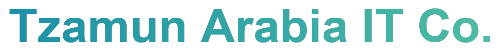
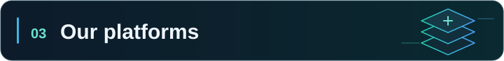

 

 

We design, build, and operate **mission-critical digital platforms** — from full-scale ERP and healthcare systems to on-premise AI and privileged-access security — engineered for Saudi businesses and aligned with **Vision 2030**.

  <a href="#about">About</a> · <a href="#services">Services</a> · <a href="#platforms">Platforms</a> · <a href="#technology">Technology</a> · <a href="#partners">Partners</a> · <a href="#contact">Contact</a>

---

## 

**Tzamun Arabia IT Co.** is a Saudi technology company delivering modern, scalable, and mission-critical digital platforms. We help organizations transform their operations through custom software development, cloud services, AI solutions, and enterprise-grade infrastructure — with a focus on quality, security, and long-term partnership.

> **Our mission:** to be the first choice for clients seeking advanced IT services — custom business software, smart mobile applications, and digital solutions that accelerate growth and operational excellence.

---

## 

From product design and development to deployment and ongoing support.

<table>
  <tr>
    <td width="50%" valign="top">
      <h3> Custom Software</h3>
      
Business & enterprise applications, corporate web platforms, and e-commerce built to scale.

    </td>
    <td width="50%" valign="top">
      <h3> Mobile Apps</h3>
      
Native iOS & Android apps with smart application design and end-to-end delivery.

    </td>
  </tr>
  <tr>
    <td valign="top">
      <h3> Cloud & Infrastructure</h3>
      
AWS · Azure · GCP · OCI · OVHcloud — hosting, VPS, hybrid & on-premise deployments.

    </td>
    <td valign="top">
      <h3> Enterprise AI</h3>
      
Sovereign, on-premise AI infrastructure — zero vendor dependency, PDPL-compliant.

    </td>
  </tr>
  <tr>
    <td valign="top">
      <h3> UI/UX & Product Design</h3>
      
Prototyping, user research, and experience design that puts users first.

    </td>
    <td valign="top">
      <h3> Consulting & Support</h3>
      
Digital transformation, system integration, workflow automation, long-term support.

    </td>
  </tr>
</table>

---

## 

Purpose-built products for healthcare, business operations, AI, and everyday services.

###  Healthcare & Medical

<table>
  <tr>
    <td width="50%" valign="top" align="center">
       
      
Appointment booking, offers & promotions, and multi-profile patient management

    </td>
    <td width="50%" valign="top" align="center">
       
      
Connects medical facilities with expert pathologists across KSA

    </td>
  </tr>
  <tr>
    <td colspan="2" valign="top" align="center">
       
      
Remote radiology reporting and diagnostic imaging analysis

    </td>
  </tr>
</table>

###  Enterprise & Operations

<table>
  <tr>
    <td width="50%" valign="top" align="center">
       
      
Full-scale operations management for healthcare, manufacturing & SMEs — ZATCA-compliant

    </td>
    <td width="50%" valign="top" align="center">
       
      
Privileged Access Management for modern data centers — developed & hosted in Saudi Arabia

    </td>
  </tr>
  <tr>
    <td colspan="2" valign="top" align="center">
       
      
Tzamun Control Hub — unified gateway for API management, access control & infrastructure monitoring

    </td>
  </tr>
</table>

###  AI & Developer Tools

<table>
  <tr>
    <td width="50%" valign="top" align="center">
       
      
Enterprise-grade on-premise AI — zero vendor dependency

    </td>
    <td width="50%" valign="top" align="center">
       
      
AI task management with unified memory (Auxly-Memory)

    </td>
  </tr>
  <tr>
    <td colspan="2" valign="top" align="center">
       
      
Arabic voice automation for Saudi markets

    </td>
  </tr>
</table>

###  Other Digital Ventures

<table>
  <tr>
    <td width="50%" valign="top" align="center">
       
      
Automotive workshop & garage management system

    </td>
    <td width="50%" valign="top" align="center">
       
      
Rent premium designer handbags in Saudi Arabia

    </td>
  </tr>
</table>

---

## 

The tools behind our web, mobile, cloud, and AI platforms.

**Languages & Frameworks**

 

**Cloud & DevOps**

---

## 

---

## 

<table>
  <tr>
    <td width="33%" align="center">
       
      <b>Website</b> 
      <a href="https://tzamun.sa">tzamun.sa</a>
    </td>
    <td width="33%" align="center">
       
      <b>Email</b> 
      <a href="mailto:info@tzamun.sa">info@tzamun.sa</a>
    </td>
    <td width="33%" align="center">
       
      <b>Headquarters</b> 
      Jeddah, Saudi Arabia
    </td>
  </tr>
</table>

---

**© 2026 Tzamun Arabia IT Co.** · All rights reserved

Jeddah, Saudi Arabia · Built in Saudi Arabia · Aligned with Vision 2030

**Built with purpose. Ready for what’s next.**

