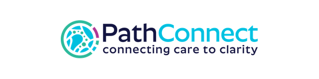
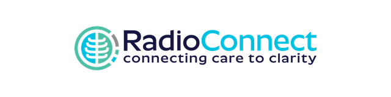
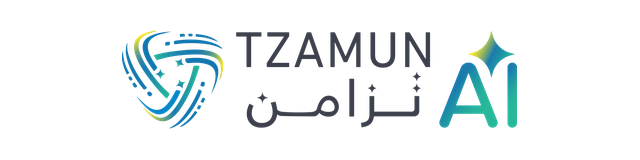
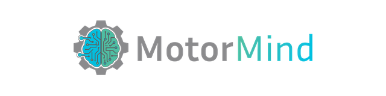

# Tzamun Arabia IT Co.

### شركة تزامن العربية لتقنية المعلومات

We design, build, and operate **mission-critical digital platforms** — from full-scale ERP and healthcare systems to on-premise AI and privileged-access security — engineered for Saudi businesses and aligned with **Vision 2030**.

---

##  Who We Are

**Tzamun Arabia IT Co.** is a Saudi technology company delivering modern, scalable, and mission-critical digital platforms. We help organizations transform their operations through custom software development, cloud services, AI solutions, and enterprise-grade infrastructure — with a focus on quality, security, and long-term partnership.

> 💡 **Our mission:** to be the first choice for clients seeking advanced IT services — custom business software, smart mobile applications, and digital solutions that accelerate growth and operational excellence.

---

##  What We Do

<table>
  <tr>
    <td width="50%" valign="top">
      <h3> Custom Software</h3>
      
Business & enterprise applications, corporate web platforms, and e-commerce built to scale.

    </td>
    <td width="50%" valign="top">
      <h3> Mobile Apps</h3>
      
Native iOS & Android apps with smart application design and end-to-end delivery.

    </td>
  </tr>
  <tr>
    <td valign="top">
      <h3> Cloud & Infrastructure</h3>
      
AWS · Azure · GCP · OCI · OVHcloud — hosting, VPS, hybrid & on-premise deployments.

    </td>
    <td valign="top">
      <h3> Enterprise AI</h3>
      
Sovereign, on-premise AI infrastructure — zero vendor dependency, PDPL-compliant.

    </td>
  </tr>
  <tr>
    <td valign="top">
      <h3> UI/UX & Product Design</h3>
      
Prototyping, user research, and experience design that puts users first.

    </td>
    <td valign="top">
      <h3> Consulting & Support</h3>
      
Digital transformation, system integration, workflow automation, long-term support.

    </td>
  </tr>
</table>

---

##  Flagship Products & Platforms

###  Healthcare & Medical

<table>
  <tr>
    <td width="33%" valign="top" align="center">
       
      Appointment booking, offers & promotions, and multi-profile patient management
    </td>
    <td width="33%" valign="top" align="center">
       
      Connects medical facilities with expert pathologists across KSA
    </td>
    <td width="33%" valign="top" align="center">
       
      Remote radiology reporting and diagnostic imaging analysis
    </td>
  </tr>
</table>

###  Enterprise & Operations

<table>
  <tr>
    <td width="33%" valign="top" align="center">
       
      Full-scale operations management for healthcare, manufacturing & SMEs — ZATCA-compliant
    </td>
    <td width="33%" valign="top" align="center">
       
      Privileged Access Management for modern data centers — developed & hosted in Saudi Arabia
    </td>
    <td width="33%" valign="top" align="center">
       
      Tzamun Control Hub — unified gateway for API management, access control & infrastructure monitoring
    </td>
  </tr>
</table>

###  AI & Developer Tools

<table>
  <tr>
    <td width="33%" valign="top" align="center">
       
      Enterprise-grade on-premise AI — zero vendor dependency
    </td>
    <td width="33%" valign="top" align="center">
       
      AI task management with unified memory (Auxly-Memory)
    </td>
    <td width="33%" valign="top" align="center">
       
      Arabic voice automation for Saudi markets
    </td>
  </tr>
</table>

###  Other Digital Ventures

<table>
  <tr>
    <td width="50%" valign="top" align="center">
       
      Automotive workshop & garage management system
    </td>
    <td width="50%" valign="top" align="center">
       
      Rent premium designer handbags in Saudi Arabia
    </td>
  </tr>
</table>

---

##  Technology Stack

**⚙️ Languages & Frameworks**

 

**☁️ Cloud & DevOps**

---

##  Technology Partners

---

##  Get in Touch

**Tzamun Arabia IT Co.** · 📍 Jeddah, Saudi Arabia

 

